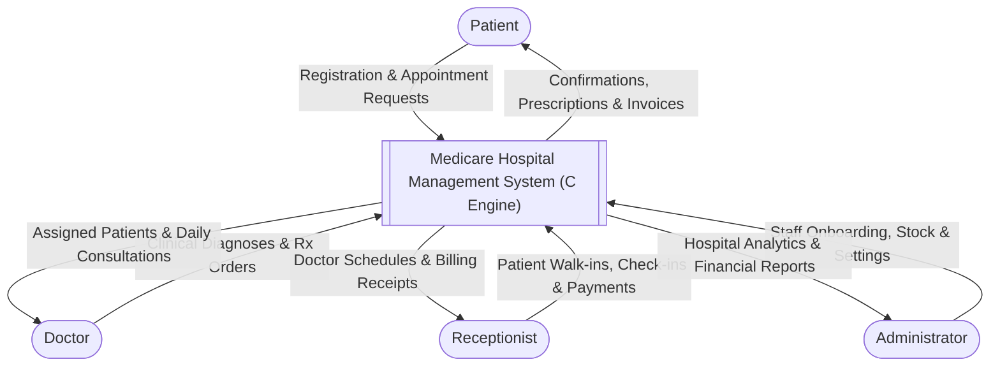
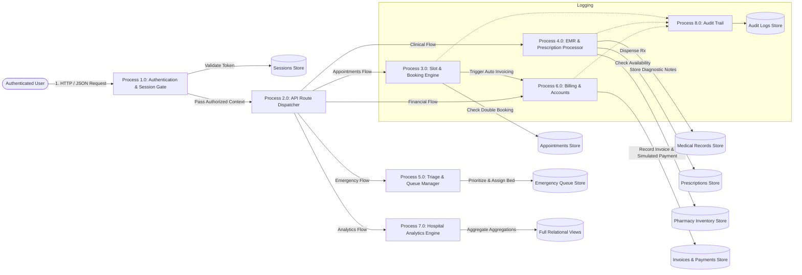

# Data Flow Diagram (DFD) - Hospital Management System

## Level 0 Context Diagram

```mermaid
flowchart TD
    Patient(["Patient"])
    Doctor(["Doctor"])
    Receptionist(["Receptionist"])
    Admin(["Administrator"])

    HMS[["Medicare Hospital Management System (C Engine)"]]

    Patient -->|Registration & Appointment Requests| HMS
    HMS -->|Confirmations, Prescriptions & Invoices| Patient

    Doctor -->|Clinical Diagnoses & Rx Orders| HMS
    HMS -->|Assigned Patients & Daily Consultations| Doctor

    Receptionist -->|Patient Walk-ins, Check-ins & Payments| HMS
    HMS -->|Doctor Schedules & Billing Receipts| Receptionist

    Admin -->|Staff Onboarding, Stock & Settings| HMS
    HMS -->|Hospital Analytics & Financial Reports| Admin
```

## Level 1 Data Flow Architecture

```mermaid
flowchart LR
    User(["Authenticated User"]) -->|1. HTTP / JSON Request| Auth["Process 1.0: Authentication & Session Gate"]
    Auth -->|Validate Token| SessionStore[("Sessions Store")]
    Auth -->|Pass Authorized Context| Dispatcher["Process 2.0: API Route Dispatcher"]

    Dispatcher -->|Appointments Flow| ApptProc["Process 3.0: Slot & Booking Engine"]
    ApptProc -->|Check Double Booking| ApptStore[("Appointments Store")]
    ApptProc -->|Trigger Auto Invoicing| BillProc["Process 6.0: Billing & Accounts"]

    Dispatcher -->|Clinical Flow| EMRProc["Process 4.0: EMR & Prescription Processor"]
    EMRProc -->|Store Diagnostic Notes| EMRStore[("Medical Records Store")]
    EMRProc -->|Dispense Rx| RxStore[("Prescriptions Store")]
    EMRProc -->|Check Availability| PharmStore[("Pharmacy Inventory Store")]

    Dispatcher -->|Financial Flow| BillProc
    BillProc -->|Record Invoice & Simulated Payment| InvStore[("Invoices & Payments Store")]

    Dispatcher -->|Emergency Flow| EmgProc["Process 5.0: Triage & Queue Manager"]
    EmgProc -->|Prioritize & Assign Bed| EmgStore[("Emergency Queue Store")]

    Dispatcher -->|Analytics Flow| ReportProc["Process 7.0: Hospital Analytics Engine"]
    ReportProc -->|Aggregate Aggregations| ReportStore[("Full Relational Views")]

    subgraph Logging
        AuditProc["Process 8.0: Audit Trail"]
        ApptProc -.-> AuditProc
        EMRProc -.-> AuditProc
        BillProc -.-> AuditProc
        AuditProc --> AuditStore[("Audit Logs Store")]
    end
```

